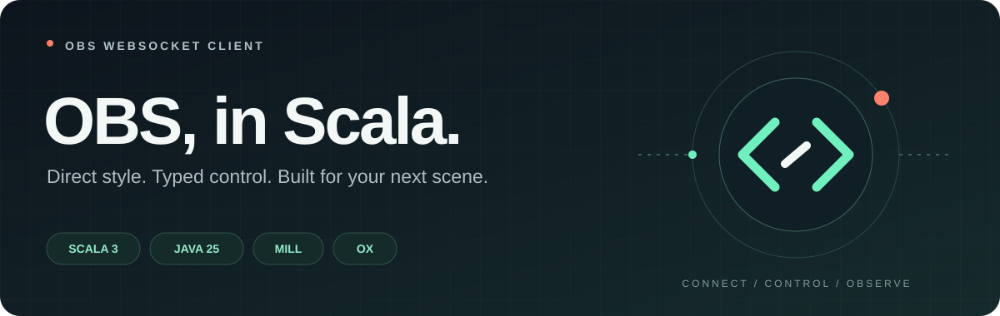

<p align="center">
  
</p>

<h1 align="center">OBS WebSocket Client</h1>

<p align="center">Typed, scoped OBS Studio control for Scala 3.<br />Java 25 · Ox · sttp · jsoniter-scala · Mill</p>

<p align="center">
  <a href="docs/README.md">Guides</a> ·
  <a href="docs/architecture.md">Architecture</a> ·
  <a href="LICENSE">MIT</a>
</p>

**Implemented, unreleased.** The library builds and passes local protocol, concurrency,
WebSocket, HTTP, packaging, and coverage checks. No Maven Central release or Pages
deployment has been performed. An isolated OBS 30.2.3 smoke test passed; see the
[compatibility matrix](docs/compatibility.md) for its tested scope.

## Typed control, bounded concurrency

- Generated bindings for **147 requests, 60 events, and seven enum groups** from a pinned OBS schema.
- Category APIs, lossless typed nested views, typed subscriptions, and validated workflow helpers.
- Per-call budgets, bounded diagnostic streams, optional event sampling, and explicit readiness recovery.
- Scoped authentication and connection ownership; typed expected failures and separate deadlines.
- Concurrent request correlation, typed heterogeneous batches, and explicit raw extension APIs.
- Broadcast Ox flows, bounded subscriber buffers, overflow errors, and opt-in loss policies.
- Opt-in reconnect with bounded jittered backoff, fresh generations, and event-gap notices.
- A separate Tapir/Netty sample with Swagger and typed PureConfig/HOCON configuration.

OBS WebSocket 5.x JSON text / RPC 1 is the target. Some newer catalog fields require
newer OBS versions; [compatibility](docs/compatibility.md) distinguishes the schema
from tested servers. The client never automatically replays outstanding requests.

## Use the client

Enable OBS's WebSocket server and supply its password through your application.

```scala
import com.worxbend.obs.websocket.client.*
import com.worxbend.obs.websocket.client.protocol.requests.GetSceneList
import com.worxbend.obs.websocket.client.transport.sttp.SttpObsClient

val config = ObsConfig(
  passwordProvider = PasswordProvider.fixed(sys.env.get("OBS_WS_PASSWORD"))
)
val scenes = SttpObsClient.connect(config)(_.request(GetSceneList())).flatten
```

The callback owns the connection. On exit, the client closes the socket and joins
its workers. Expected failures are returned as `Either[ObsError, A]`.
See the [quickstart](docs/quickstart.md), [request guide](docs/requests.md), and
[event guide](docs/events.md) for subscriptions, batches, cancellation, and reconnect.

## Artifacts

Seven modules publish independently; coordinates are provisional until the first
release. Pick exactly one backend adapter — it brings `core` and `protocol` along:

| Artifact | Choose this when |
| --- | --- |
| `obs-websocket-client-protocol` | You need only the generated models and catalog. |
| `obs-websocket-client-core` | You bring your own `ObsTransport`; session engine only. |
| `obs-websocket-client-sttp` | Default: JDK `HttpClient` sync backend, no effect runtime. |
| `obs-websocket-client-okhttp` | You prefer the OkHttp sync client (still no effect runtime). |
| `obs-websocket-client-zio` | Your stack is ZIO; the runtime stays an internal bridge. |
| `obs-websocket-client-fs2` | Your stack is cats-effect/fs2; the runtime stays an internal bridge. |
| `obs-websocket-client-pekko` | Your stack is Pekko streams; the `ActorSystem` stays an internal bridge. |

Every adapter presents the same blocking `ObsSession` API. See
[choosing a WebSocket backend](docs/guides/backends.md) for coordinates, ownership,
and per-backend behavioral differences.

## Build and run

The checked-in wrapper pins **Mill 1.1.10, Scala 3.9.0, and Temurin Java 25.0.3**.

```sh
./mill --no-server '{codegen,protocol,core,sttp,okhttp,zio,fs2,pekko,examples,server}.test'
./mill --no-server examples.run
./mill --no-server server.run
./mill --no-server site.build
tools/coverage.sh
tools/consumer_smoke.sh
```

Use `OBS_WS_PASSWORD` for the CLI. The HTTP sample reads `application.conf` through
PureConfig, with `OBS_WS_URL`, `OBS_WS_PASSWORD`, `HTTP_HOST`, and `HTTP_PORT`
overrides. It binds locally by default; Swagger is at `http://127.0.0.1:8080/docs/`.
`--no-server` avoids a Mill worker-reuse failure observed in this development environment.

Published coordinates will be documented after the first release. For development,
`./mill --no-server '{protocol,core,sttp,okhttp,zio,fs2,pekko}.publishLocal'` installs
local snapshots. The isolated consumer smoke test validates transitive dependencies
from packaged artifacts.

## Measured quality

The clean local coverage gate enforces exactly 100% statements and 100% branches in
every production module — ten modules checked by `tools/check_coverage.py`, including
generator logic, generated bindings, backend adapters, and examples. It rejects missing, stale, or
inconsistent evidence. It does not establish real OBS compatibility or certify a public
CI run; fresh measurements are produced by `tools/coverage.sh` and archived as CI artifacts.

CI workflows cover validation, documentation, compatibility checks, disposable OBS
checks, and explicit release preflight/publication.

## Contributing and licensing

Read the [contributor guide](docs/contributing.md).
The reusable dependency direction is `protocol ← core ← {sttp, zio, fs2, pekko}`, with
`sttp ← okhttp`; server and examples remain separate. Ordinary builds generate offline
from the pinned schema.

The [architecture overview](docs/architecture.md) diagrams module dependencies,
connection establishment, request/event dispatch, and reconnect ownership.
[Decision records](docs/decisions.md) explain these boundaries and their trade-offs.

First-party code uses the [MIT License](LICENSE), as selected by the maintainer.
The bundled [OBS schema](protocol-spec/README.md) retains its upstream attribution
and license. Review of schema-derived output licensing is a publication gate.

Inspired by [ktobs](https://github.com/Rejeq/ktobs) and the
[VirtusLab Scala Stack](https://vss.virtuslab.com/). The project mark is original.
This is an independent community client, unaffiliated with OBS Studio.
