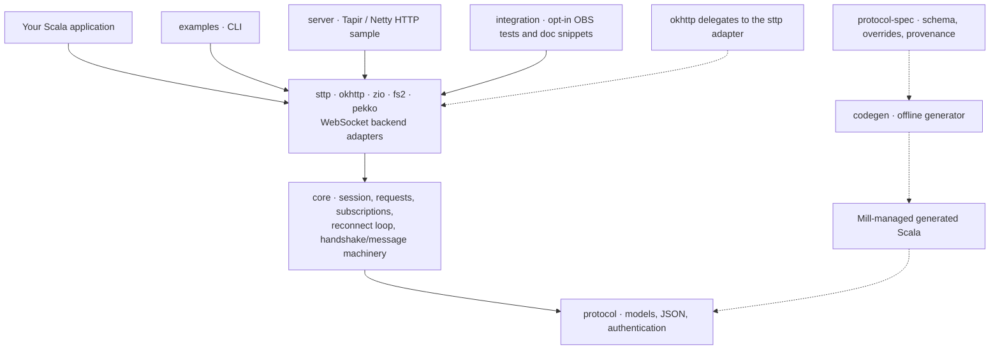
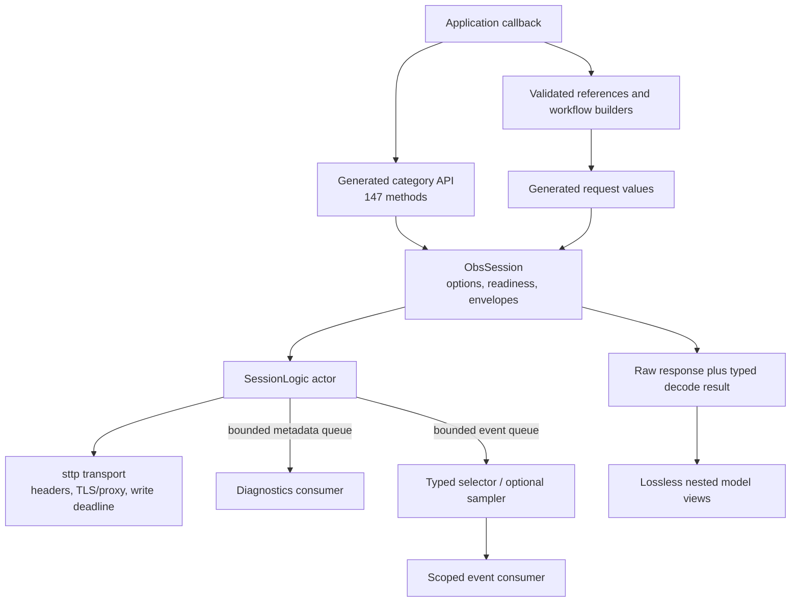
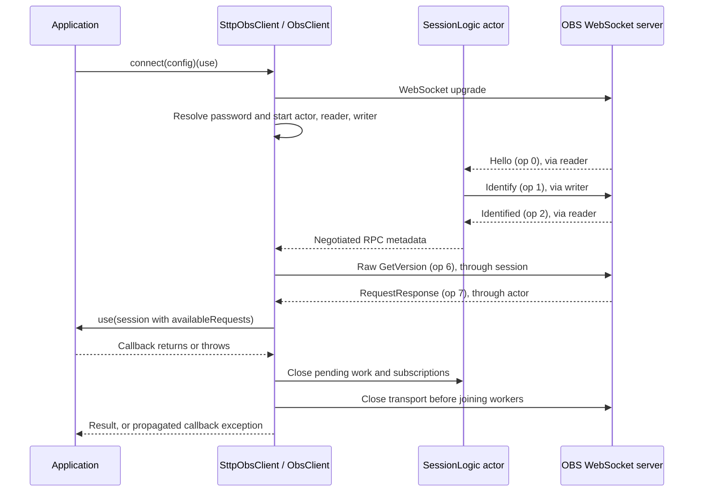
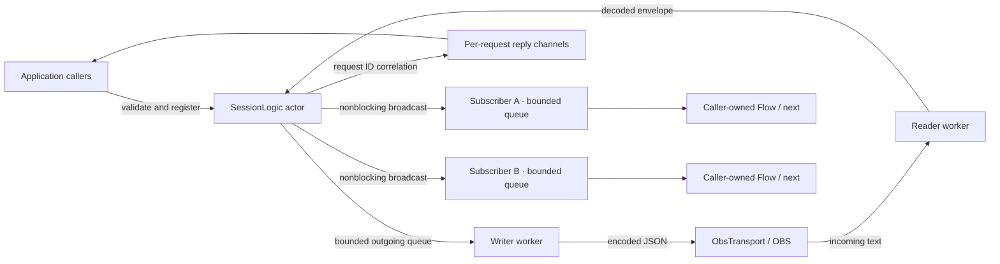
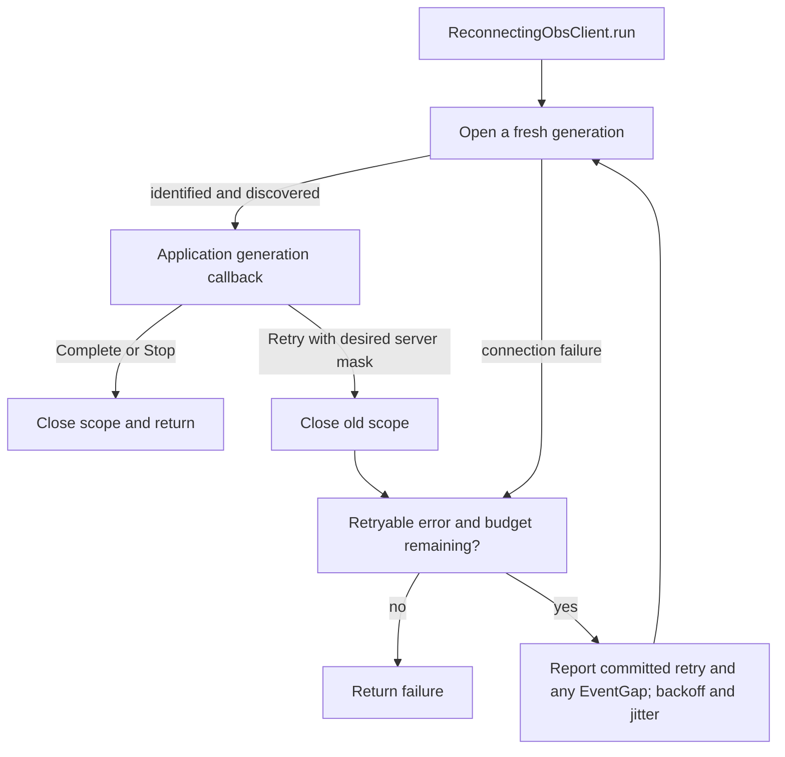

# Current architecture

The client is a Scala 3 library that owns an OBS WebSocket connection for the lifetime of an application callback. Generated protocol bindings describe messages; an Ox actor coordinates requests and events; a pluggable backend adapter handles the socket. The HTTP server is a separate consumer of that library.

This page describes the implementation inspected on 2026-10-04, not the target design in [PLAN.md](../PLAN.md). It does not claim a published release or broader OBS compatibility. Existing test measurements and release gates remain in [IMPLEMENTATION.md](../IMPLEMENTATION.md).

## Module boundaries

Solid arrows point from a consumer to its dependency. Dotted arrows show build-time generation; `codegen` is not a runtime dependency of `protocol`:

The dependency declarations are in [build.mill](../build.mill). Seven modules are publishable libraries: `protocol`, `core`, and the backend adapters `sttp`, `okhttp`, `zio`, `fs2`, and `pekko`. Each backend adapter depends on `core` alone, except `okhttp`, which also depends on `sttp` because it delegates to `SttpObsClient.withBackend`. Tapir, Netty, PureConfig, and the sample's logging backend are confined to `server`; applications using the library do not acquire these server dependencies.

| Component | Responsibility | Source entry point |
| --- | --- | --- |
| `protocol` | Wire envelopes, bounded JSON decoding, field semantics, authentication, generated catalog | [WireMessage.scala](../protocol/src/com/worxbend/obs/websocket/client/protocol/WireMessage.scala) |
| `core` | Scoped connection engine and typed public session API; backend-agnostic reconnect loop and handshake/message machinery | [ObsClient.scala](../core/src/com/worxbend/obs/websocket/client/ObsClient.scala), [ObsSession.scala](../core/src/com/worxbend/obs/websocket/client/ObsSession.scala) |
| `sttp` | JDK `HttpClient` sync backend: upgrade, frame handling, physical shutdown, reconnect entrypoint | [SttpObsClient.scala](../sttp/src/com/worxbend/obs/websocket/client/transport/sttp/SttpObsClient.scala) |
| `okhttp` | OkHttp sync adapter over the sttp module's `withBackend` seam | [OkHttpObsClient.scala](../okhttp/src/com/worxbend/obs/websocket/client/transport/okhttp/OkHttpObsClient.scala) |
| `zio` | Bridged ZIO adapter; internal ZIO runtime behind the blocking `ObsTransport` | [ZioObsClient.scala](../zio/src/com/worxbend/obs/websocket/client/transport/zio/ZioObsClient.scala) |
| `fs2` | Bridged cats-effect/fs2 adapter; internal `IORuntime` and dispatcher | [Fs2ObsClient.scala](../fs2/src/com/worxbend/obs/websocket/client/transport/fs2/Fs2ObsClient.scala) |
| `pekko` | Bridged Pekko adapter; owned `ActorSystem` behind the blocking `ObsTransport` | [PekkoObsClient.scala](../pekko/src/com/worxbend/obs/websocket/client/transport/pekko/PekkoObsClient.scala) |
| `codegen` | Validate pinned inputs and emit Scala plus catalog inventory | [Generate.scala](../codegen/src/com/worxbend/obs/websocket/client/codegen/Generate.scala) |
| `examples` | Runnable version and scene discovery | [Quickstart.scala](../examples/src/com/worxbend/obs/websocket/client/examples/Quickstart.scala) |
| `server` | Local HTTP sample and generated Swagger/OpenAPI | [Endpoints.scala](../server/src/com/worxbend/obs/websocket/client/server/Endpoints.scala) |

The `zio`, `fs2`, and `pekko` modules implement the same blocking `ObsTransport` contract as the sync adapters through an internal effect-runtime bridge over the monadic `sttp.ws.WebSocket[F]` shape: an internal ZIO `Runtime` for `zio`, an `IORuntime` plus `Dispatcher` for `fs2`, and an owned `ActorSystem` for `pekko`. The reconnect family (`ReconnectPolicy`, `ReconnectTiming`, `ReconnectDecision`, `ReconnectNotice`, `ConnectionGeneration`, `ReconnectConnector`, and the generic loop `Reconnect.run`), `HandshakeHeaders`, and the text-fragment/byte-limit `MessageAssembler` live in `core` — packages `com.worxbend.obs.websocket.client.reconnect` and `...transport` — so every backend adapter, present and future, shares them without depending on the JDK sync backend.

The build pins Mill 1.1.10, Scala 3.9.0, and Temurin Java 25.0.3. These are repository pins, not a claim about the latest available releases. The base package is `com.worxbend.obs.websocket.client`.

## Convenience APIs and observations

The category facade and pure workflow builders feed the existing request engine. Typed model views retain the raw nested response, so a newer server's additional fields remain accessible. Diagnostics and sampled events leave the actor through bounded channels; consumer code owns processing:

Per-call budgets cover registration and response waiting. A transport write deadline physically aborts a stalled connection before worker cleanup. Optional readiness retry handles explicit NotReady responses for reviewed read requests, including startup discovery when configured; it does not replay uncertain writes. See [ADR-004](decisions/004-additive-peer-features.md) and the [feature comparison](feature-expansion.md).

## Connection establishment

`SttpObsClient.connect` creates an owned JDK HTTP client, performs the WebSocket upgrade, and delegates to `ObsClient.withTransport`. The application receives its session only after identification and a successful raw `GetVersion` capability query:

The handshake accepts peers advertising RPC version 1 or higher and identifies with RPC 1; the acknowledgement must negotiate exactly 1. Authentication uses the challenge/salt helper in [Authentication.scala](../protocol/src/com/worxbend/obs/websocket/client/protocol/Authentication.scala). Connection, handshake, request, and shutdown deadlines are separate configuration values.

The live actor starts in `AwaitingHello`, transitions through `Identifying` to `Ready`, and terminates as `Failed` or `Closed`. `Connecting` and `Closing` exist in the public transition table but are reserved; the live session does not enter them. `Ready` is reached internally before capability discovery; the application callback still waits for discovery to finish. See [ConnectionState.scala](../core/src/com/worxbend/obs/websocket/client/ConnectionState.scala).

Expected failures use `Either[ObsError, A]`. A callback returning an operation's `Either` produces a nested result; callers can use `flatten`. Application exceptions and interruption are not converted wholesale into `ObsError`; cleanup still runs.

## Requests and event dispatch

Each connection has one reader, one serialized writer, and one `SessionLogic` actor. The actor owns pending-request and subscriber maps. Application code waits on its own reply or subscription channel:

Typed `Request[A]` values select their response decoder and are checked against the discovered request names. `RawRequest` and `rawRequest` bypass the capability gate for extensions. Registration precedes enqueueing, so a fast response can find its pending entry. Timeout or cancellation removes only the matching request, and late or duplicate responses are ignored. A timed-out request already claimed by the writer may still execute in OBS; timeout is not proof of nonexecution.

Event decoding and nonblocking broadcast happen in the actor. Known malformed events fail the session, even for raw subscriptions. An unknown event is preserved as `UnknownEvent`. Every local subscriber receives future matching events independently; there is no replay buffer. A slow subscriber's default overflow policy terminates that subscription. Explicit drop policies count lost events. User callbacks run in the consuming caller, never on the reader or actor.

| Limit | Default | Behavior at the boundary |
| --- | --- | --- |
| Pending operations | `maxInFlight = 256` | Reject registration with `Overflow` |
| Outgoing messages | `outgoingCapacity = 256` | Reject enqueueing with `Overflow` |
| Events per subscriber | `subscriptionCapacity = 128` | Fail that subscriber, or apply its explicit drop policy |
| Message bytes | `maxMessageBytes` from the protocol default | Reject oversized outgoing operations; fail the session for oversized input |
| Reply wait | `requestTimeout = 10.seconds` | Return `Timeout` and remove pending registration |

These limits do not impose a maximum number of application-created subscriptions. Applications remain responsible for bounding their own concurrent consumers. See [ObsConfig.scala](../core/src/com/worxbend/obs/websocket/client/ObsConfig.scala), [requests](requests.md), and [events](events.md).

Batch requests share the correlation path. Serial realtime and serial frame execution preserve submitted positions, with explicit halt/continue handling and typed heterogeneous results. Nonempty parallel batches are rejected locally because results cannot be reliably associated on supported OBS servers. Batches have no rollback; a missing response can leave an ambiguous outcome.

## Ownership and reconnect

On callback exit, logical close completes pending operations and subscriptions, then transport close unblocks receive before Ox joins the workers. The default sttp entrypoint attempts a bounded WebSocket Close and force-shuts down its owned JDK client; the other adapters tear down their owned client, dispatcher, runtime, or actor system with the same bounded-Close-then-force discipline. `withBackend` leaves the shared backend with its caller; the caller must supply a prompt, idempotent `abortConnection` callback that closes only this connection and configure a finite upgrade deadline.

The optional reconnect wrapper runs outside each connection scope:

Every successful attempt invokes the callback again with a new `ConnectionGeneration`; credentials are resolved afresh. The supplied server subscription mask survives an explicit `Retry`, but local `withEvents` subscriptions must be recreated inside the callback. Outstanding requests never move between generations. Authentication failures, incompatible protocols, malformed messages, and OBS application close codes are terminal; transient failures are classified by [ReconnectPolicy.scala](../core/src/com/worxbend/obs/websocket/client/reconnect/ReconnectPolicy.scala).

`EventGap` is emitted only for a completed generation whose retry is committed, immediately before `RetryScheduled`. A terminal failure or an initial connection failure does not create an event-gap notice.

The application chooses when to return `Retry`. The wrapper does not monitor and restart an arbitrary still-running callback. Put recovery logic around event consumption and keep already-completed mutations outside a callback that can run again.

## HTTP sample boundary

`Main` owns one Netty server binding inside an Ox scope and stops it during shutdown. `GET /health` reports HTTP liveness without contacting OBS. `GET /obs/version` calls `ObsReadService.version`, opens a fresh scoped OBS connection for that HTTP request, and returns the OBS and WebSocket versions. The internal capability query runs before the service's typed version query, so this route makes two `GetVersion` requests per connection.

OBS failures map to HTTP 503 with the generic `ApiFailure` response. Swagger and OpenAPI use the same endpoint collection. The current sample has no shared application-wide OBS session, scenes HTTP route, persistence, or AI integration. Those must not be inferred from the broader plan. See [HTTP sample](server.md).

## Generated protocol and verification boundaries

The [generator architecture and contributor guide](code-generation.md) describes the CLI, schema normalization, immutable models, and per-output Scala templates. The [design decision](ideas/codegen-templates.md) records the template tradeoffs.

The generator reads the checked-in schema, overrides, and provenance, verifies the schema checksum, and emits sources under Mill's `out/` directory. The pinned inventory contains 147 requests, 60 events, and seven enum groups. `Field` distinguishes omitted, null, and present optional values; numbers retain exact `BigDecimal` values within decoder limits. Loose upstream object shapes remain validated `JsonObject` values.

Generated catalog coverage does not establish that every operation works against every OBS 5.x release. The [compatibility matrix](compatibility.md) records the tested OBS 30.2.3 / obs-websocket 5.5.2 scope and newer-schema limitations. Local peer tests exercise transport faults; real OBS tests are a separate opt-in layer. Historical coverage totals in the implementation report are measured evidence, not measurements newly produced by this architecture review.

The following source-to-behavior map makes the diagrams auditable:

| Evidence | Finding | Runtime or build path |
| --- | --- | --- |
| `build.mill`, `protocol-spec/provenance.json` | Schema generation is an explicit build dependency | Pinned inputs → generator → generated protocol sources |
| `ObsClient.run`, `SessionLogic.register` | Capability discovery precedes application use; correlation precedes send | Upgrade → handshake → discovery → callback → request |
| `SessionLogic.event`, `ObsSubscription` | Subscribers have independent queues and caller-owned consumers | Reader → actor → matching queues → caller |
| `SttpObsClient`, `SttpTransport.close` | Physical teardown has explicit backend ownership | Callback exit → logical close → socket close → worker join |
| `Reconnect.run`, `ReconnectingObsClient.run` | Retry owns a new connection scope | Old scope ends → backoff → new generation |
| `ObsReadService.version` | The sample uses request-scoped connections | HTTP request → scoped client → typed query → close |

Design rationale is recorded in [architecture decisions](decisions.md). To exercise the public boundary, follow [Connect to OBS and read version and scenes](guides/read-version-and-scenes.md).
